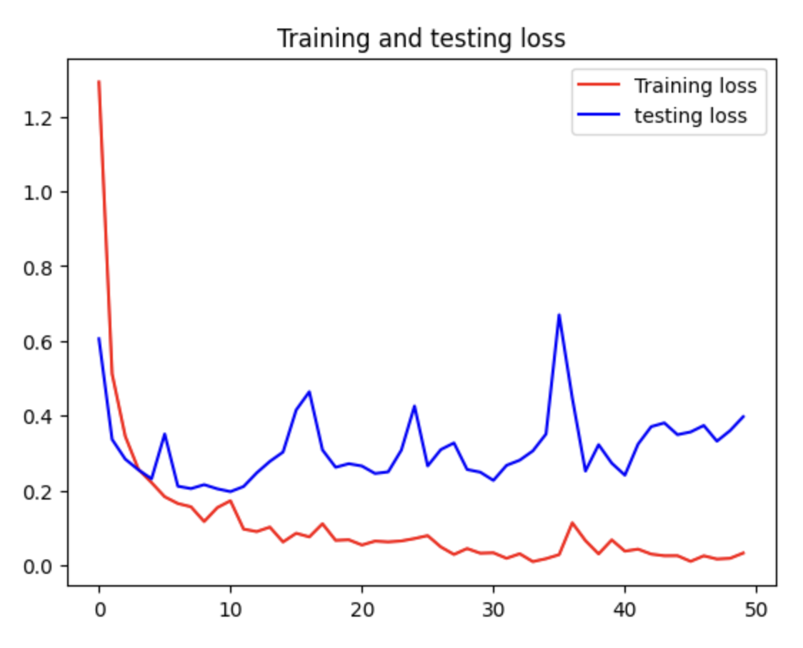
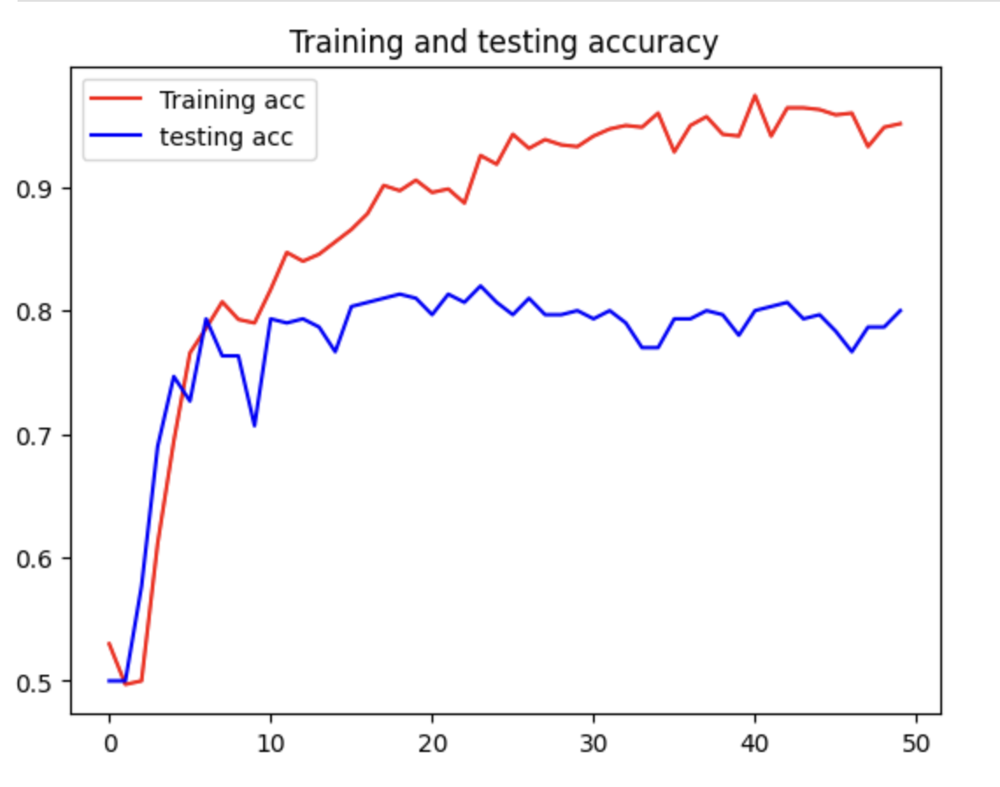

<details>
<summary> 📌 Issue : Image truncated, accuracy</summary><br>

- try1. PIL 라이브러리로 파일 손상 검사 돌려봄 → 이미지 손상은 X
- try2. `ImageFile.LOAD_TRUNCATED_IMAGES = True` 설정
    - 트레이닝 돌리면 돌아는 가는데 예상보다 더 **accuracy가 낮게나옴**
    - 이미지가 잘려서 파일 일부만 입력으로 들어가서인듯
- try3. 데이터 형상 상수 정의 - 사진 크기 설정
    - 코랩(GPU) - 세션이 자꾸 죽음
    - 주피터(CPU) - 600*600 으로 돌리면 → ETA: 4시간 이상
        - 집가서 서브 노트북으로 돌려보기…
    - image size=256*256, batch size=10/5, epoch=3
    - image size=512*512, batch size=5, epoch=10
  
    - image size=256*256, batch size=5, epoch=10

    - **image size=256*256, batch size=8, epoch=10 `best`**    
    - image size=256*256, batch size=16, epoch=10      
    - image size=256*256, batch size16, epoch=30
        - 30으로 돌렸는데 다 안돌아감


        
    - image size=256*256, batch size=32, epoch=10
        
- try4. 이미지 resize
- 1000*1000 돌려본 결과 공유 → 데이터 더 수집해야할지 말지
    - 코랩에서는 세션 죽음, RAM 부족
    - CNN 모델에서 일반적으로 작은 이미지를 사용하는 이유
        
        <u>모델 복잡성:</u> CNN 모델은 보통 이미지의 로컬 패턴과 구조를 학습하기 위해 작은 합성곱 필터를 사용합니다. 작은 이미지에서도 로컬 패턴을 잘 파악할 수 있으며, 이미지를 크게 하면 이러한 로컬 패턴이 희석될 수 있습니다. 따라서 작은 이미지 크기로 충분한 성능을 얻을 수 있습니다.
        
        <u>Overfitting의 위험 감소:</u> 큰 이미지를 사용하면 모델이 작은 세부 사항에 더 많이 fitting되는 경향이 있습니다. 작은 이미지에서는 학습 데이터의 다양성을 잘 반영하고 일반화된 모델을 학습하는 데 도움이 될 수 있습니다.
        
        라고 합니다.. </details><br>

> ### 두가지 모델 비교 

- **Sequential 모델:**
    - Keras라는 딥러닝 라이브러리에서 제공하는 API로, 간단하고 순차적인 딥러닝 모델을 만들 수 있게 해준다.
    - 레이어를 순차적으로 쌓아 구성하고, <u>각 레이어는 이전 레이어의 출력을 입력으로 받아</u> 처리한다.
    - <u><i>단순하고 직관적인 설계</i></u>를 위해 주로 사용되며, 비교적 작은 규모의 모델에 적합하다. 

<br>

- **VGG16 모델:**
    - 옥스퍼드 대학에서 개발한 딥러닝 아키텍처로, 이미지 인식 대회인 ImageNet Challenge에서 우수한 성능을 보여준 모델
    - 16개의 레이어로 구성된 깊은 신경망으로 합성곱(Convolution)과 풀링(Pooling) 레이어로 구성되어 있으며, 마지막에는 완전 연결층(Fully Connected Layer)으로 이어진다.
    - VGG16은 작은 필터 크기(3x3)를 사용하여 깊은 네트워크를 구성하고, 많은 필터(총 16개의 레이어에서 13개의 합성곱 레이어)를 사용하여 다양한 이미지 특징을 추출한다.
    - VGG16은 ImageNet 데이터셋으로 사전 훈련된 가중치를 제공하므로, 전이 학습(Transfer Learning)에 많이 사용된다.

<br><br>

# 1. Sequential

## 🌟 데이터 Augmentation

```python
# 트레이닝 데이터의 제너레이터 설정
train_datagen=ImageDataGenerator(
			rotation_range=15,
			rescale=1./255,
			shear_range=0.1,
			zoom_range=0.2,
			horizontal_flip=True,
			width_shift_range=0.1,
			height_shift_range=0.1)
```

1. `rotation_range`: 지정된 각도 범위 내에서 이미지를 -15도부터 +15도까지 무작위로 회전시키기
2. `rescale`: 이미지의 픽셀 값을 0과 1 사이로 조정하여 모델의 성능을 개선하고 학습 속도를 향상시키는 데 도움을 줄 수 있다.
3. `shear_range`: 이미지를  -0.1부터 +0.1까지 무작위로 전단 변형시켜 이미지를 기울이는 효과를 주어 다양한 각도의 관점에서 객체를 인식할 수 있도록 한다
4. `zoom_range`: 이미지를 0.8배에서 1.2배까지 무작위로  확대/축소하여 다양한 크기와 해상도의 이미지를 처리할 수 있도록 한다. 
5. `horizontal_flip`: 50%의 확률로 이미지를 수평으로 뒤집어 좌우 대칭성을 고려할 수 있도록 한다.
6. `width_shift_range` / `height_shift_range`: 이미지를 -0.1부터 +0.1까지 무작위로수평 및 수직으로 이동시켜 이미지의 위치 변화에 대응할 수 있도록 한다.

<br>

## 최종 모델

> 💡 Training Value
>- loss: 훈련 손실 값
현재 배치에서 모델이 예측한 출력과 실제 레이블 사이의 차이 → `모델의 적합성`
>- accuracy: 훈련 정확도
>현재 배치에서 모델이 올바르게 분류한 샘플의 비율 → `모델의 성능`
>- val_loss: 검증 손실 값 
검증 데이터셋에서 모델의 예측과 실제 레이블 사이의 차이 → `일반화 성능`
>- val_accuracy: 검증 정확도
검증 데이터셋에서 모델이 올바르게 분류한 샘플의 비율 → `일반화 성능`
>- lr: 학습률(learning rate)
모델이 가중치를 업데이트하는 속도를 조절하는 하이퍼파라미터

<br><br>

### 선정성: 노출/비노출 분류
|  |  |  |
|:---:|:---:|:---:|
| 손실값 | 정확도 | 과적합 |


<br>

### 선정성: 관계/비관계 분류 
|  |  |  |
|:---:|:---:|:---:|
| 손실값 | 정확도 | 과적합 |


<br>

### 폭력성: 폭력/비폭력 분류
|  |  |  |
|:---:|:---:|:---:|
| 손실값 | 정확도 | 과적합 |

<br><br>

# 2. VGG16

## 🌟 데이터 Augmentation

```python
# 트레이닝 데이터의 제너레이터 설정
train_datagen=ImageDataGenerator(
			rotation_range=15,
			rescale=1./255,
			shear_range=0.1,
			zoom_range=0.2,
			horizontal_flip=True,
			width_shift_range=0.1,
			height_shift_range=0.1)
```

1. `rotation_range`: 지정된 각도 범위 내에서 이미지를 -15도부터 +15도까지 무작위로 회전시키기
2. `rescale`: 이미지의 픽셀 값을 0과 1 사이로 조정하여 모델의 성능을 개선하고 학습 속도를 향상시키는 데 도움을 줄 수 있다.
3. `shear_range`: 이미지를  -0.1부터 +0.1까지 무작위로 전단 변형시켜 이미지를 기울이는 효과를 주어 다양한 각도의 관점에서 객체를 인식할 수 있도록 한다
4. `zoom_range`: 이미지를 0.8배에서 1.2배까지 무작위로  확대/축소하여 다양한 크기와 해상도의 이미지를 처리할 수 있도록 한다. 
5. `horizontal_flip`: 50%의 확률로 이미지를 수평으로 뒤집어 좌우 대칭성을 고려할 수 있도록 한다.
6. `width_shift_range` / `height_shift_range`: 이미지를 -0.1부터 +0.1까지 무작위로수평 및 수직으로 이동시켜 이미지의 위치 변화에 대응할 수 있도록 한다.

<br>

### 선정성: 노출/비노출 분류
|  |  |
|:---:|:---:|
| 손실값 | 정확도 |

<br>

### 선정성: 관계/비관계 분류 
|  |  |
|:---:|:---:|
| 손실값 | 정확도 |


<br>

### 폭력성: 폭력/비폭력 분류
|  |  |
|:---:|:---:|
| 손실값 | 정확도 |
